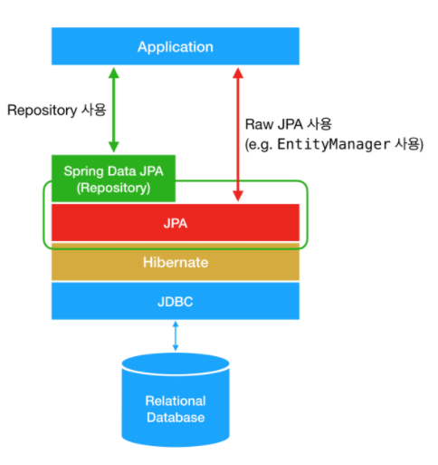

# :loudspeaker: JPA 구동원리

## JPA란?
- JPA(Java Persistence API) 여러 ORM 전문가가 참여한 EJB 3.0 스펙 작업에서 기존 EJB ORM이던 Entity Bean을 JPA라고 바꾸고  
  JavaSE, JavaEE를 위한 영속성(persistence) 관리와 ORM을 위한 표준 기술이다.  
  JPA는 ORM 표준 기술로 Hibernate, OpenJPA, EclipseLink, TopLink Essentials과 같은 구현체가 있고 이에 표준 인터페이스가 바로 JPA이다.
    - ORM(Object Relational Mapping)이란 관계형 데이터 베이스를 객체지향적으로 사용하기 위한 기술이다.  
      관계형 데이터 베이스는 객체지향적 특징(상속, 다형성, 레퍼런스, 오브젝트 등)이 없고 자바와 같은 언어로 접근하기 쉽지 않다.  
      때문에 ORM을 사용해 오브젝트와 관계형 데이터 베이스 사이에 존재하는 개념과 접근을 객체지향적으로 다루기 위한 기술이다.
- 장점
    - 객체지향적으로 데이터를 관리할 수 있기 때문에 비즈니스 로직에 집중 할 수 있으며, 객체지향 개발이 가능하다.
    - 지루하고 반복적인 개발을 지양할 수 있다.
- 단점
    - 어렵다. 장점을 더 극대화 하기 위해서 알아야 할게 많다.
    - 잘 이해하고 사용하지 않으면 데이터 손실이 있을 수 있다. (persistence context)
    - 성능상 문제가 있을 수 있다. 대표적인 예로 즉시로딩 지연로딩이 있다.

## 애플리케이션과 JPA의 연결 구조
- 애플리케이션과 데이터베이스까지의 연결 구조 사이에 JPA와 Hibernate가 중간 다리 역활을 해주고 있다.  
  Hibernate는 JPA가 여러 데이터 베이스를 호환하기 위해 JPA와 데이터베이스 사이에 호환성 구현체 역활을 한다.   
  JPA위에 Spring Data JPA가 있는데 Spring Data JPA는 반복적인 CRUD 패턴의 메소드들을 인터페이스로 모두 제공해주고있다.  
  사용해본 결과 개발자가 필요로하는 단순한 메소드는 거의 다 구현되어있는것 같다.
