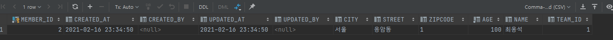
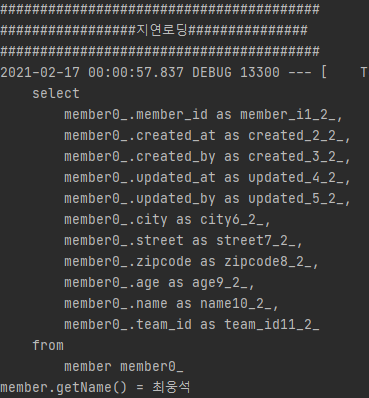
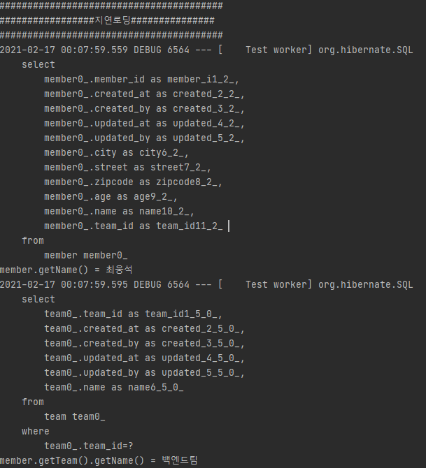

# :loudspeaker: JPA Entity 를 간략하게 사용해보자
JPA를 이용하여 간략하게 팀과 회원을 저장하고 보편적으로 업무를 하다보면 생성 시각 , 변경 시각 컬럼을 필수로 가져가는데  
이 같은 공통 컬럼 속성을 BaseEntity 클래스로 만들어 사용해보자:wink:       

## Entity 코드
```java
@Entity
@Getter @Setter
@NoArgsConstructor(access = AccessLevel.PROTECTED)
public class Team extends BaseEntity{

    @Id @GeneratedValue
    @Column(name = "team_id")
    private Long id;
    private String name;

    @OneToMany(mappedBy = "team")
    private List<Member> members = new ArrayList<>();

    public static Team createTeam(String name) {
        Team team = new Team();
        team.setName(name);
        return team;
    }

    public void addMember(Member member) {
        members.add(member);
    }
}
```

```java
@Entity
@Getter @Setter
@NoArgsConstructor(access = AccessLevel.PROTECTED)
public class Member extends BaseEntity {

    @Id @GeneratedValue
    @Column(name = "member_id")
    private Long id;
    private String name;
    private int age;

    @Embedded
    private Address address;

    @ManyToOne(fetch = FetchType.LAZY)
    @JoinColumn(name = "team_id")
    private Team team;

    public static Member createMember(String name, int age, Address address, Team team) {
        Member member = new Member();
        member.setName(name);
        member.setAge(age);
        member.setAddress(address);
        member.setTeam(team);
        return member;
    }
}
```

## BaseEntity 코드
```java
@EntityListeners(AuditingEntityListener.class)
@Inheritance(strategy = InheritanceType.SINGLE_TABLE)
@Getter @Setter
@MappedSuperclass
public abstract class BaseEntity {

    // 데이터베이스에 최초에 저장된후 수정이 되면 안되기에 updatable = false 처리를 해준다.
    @Column(updatable = false)
    private String created_at;
    @Column(updatable = false)
    private String created_by;

    private String updated_at;
    private String updated_by;

    // 영속화 전에 created_at, updated_at 시간을 만들어준다.
    @PrePersist
    public void prePersist() {
        String nowDate = LocalDateTime.now().format(DateTimeFormatter.ofPattern("yyyy-MM-dd HH:mm:ss"));
        created_at = nowDate;
        updated_at = nowDate;
    }

    // JPA 변경감지가 이루어지면 updated_at 시간을 만들어준다.
    @PreUpdate
    public void PreUpdate() {
        String nowDate = LocalDateTime.now().format(DateTimeFormatter.ofPattern("yyyy-MM-dd HH:mm:ss"));
        updated_at = nowDate;
    }

}
```

### Entity 설명
간단하게 데이터 베이스에 저장하기 위해 팀 Entity 와 회원 Entity 를 만들었다.  
팀은 여러 회원을 가질 수 있고 회원은 한 팀에게만 속할 수 있다.   
Entity 클래스를 생성할때에는 개인적으로 @Setter를 직접적으로 외부에서 호출해서 쓸 수 없도록 하는것이  
유지보수 관점이나 디버깅 측면적으로 효율적이고 객체의 안정성이 어느정도 보장된다고 생각한다.    
객체의 데이터를 변경이 필요할때에는 Entity 클래스 안에 편의 메소드를 만들어 사용하게 된다면  
추후 Entity 변경이라던가 이런 상황에 유연하게 대처할 수 있다고 생각한다.
그렇기 때문에 @NoArgsConstructor(access = AccessLevel.PROTECTED) 어노테이션을 이용하여  
각 Entity 에 생성자의 접근 권한을 PROTECTED 로 설정하였다. 그리고 데이터를 추가하기 위해 create 편의 메소드를 작성하였다.  
그리고 BaseEntity 부분을 보면 @Inheritance 어노테이션이 있는데 이것은 해당 BaseEntity 를 테이블로 분할 할 수도 있고  
하나의 테이블의 컬럼을 추가하는 방식으로 설정할 수 있는 테이블 전략 속성이다. 우린 각 테이블에 컬럼을 추가하려는 의도를 가지고 있기에  
SING_TABLE 전략을 사용했다.

### 테스트를 해보자:v:
```java
@SpringBootTest
public class MemberServiceTest {

    @Autowired EntityManager em;
    @Autowired MemberJpaRepository memberJpaRepository;

    @Test
    @Transactional
    @Rollback(value = false)
    public void 베이스엔티티_테스트() throws Exception {
        //given
        Team team = Team.createTeam("백엔드팀");
        em.persist(team);

        Address address = Address.createAddress("서울", "응암동", "1");

        Member member = Member.createMember("최웅석", 100, address, team);
        team.addMember(member);
        em.persist(member);

        //when

        //then

    }

    @Test
    @Transactional(readOnly = true)
    public void 데이터_조회() throws Exception {
        //given
        List<Member> findAllMember = memberJpaRepository.findAll();
        System.out.println("########################################");
        System.out.println("########################################");
        for (Member member : findAllMember) {
            System.out.println("member.getName() = " + member.getName());
            System.out.println("member.getTeam().getName() = " + member.getTeam().getName());
        }
        //when

        //then

    }

}
```

베이스엔티티_테스트 를 보면 Entity 설명 부분에서 만든 편의 메소드를 사용하여 객체를 생성하고 저장했다.  
데이터가 정상적으로 들어갔는지 확인을 해보자.

  
정상적으로 데이터가 저장된것을 볼 수 있다. 그리고 BaseEntity 를 이용하여 만든 저장, 수정 시각을 나타내는 컬럼도 잘 생성이 됐다.:wave:


#### :bulb: 즉시로딩과 지연로딩 전략
Entity 안에 @ManyToOne 이나 @OneToOne 같은 Entity 간의 연관관계를 설정을 해둔것을 볼 수 있다.  
연관관계를 설정할때 중요한 속성값이 있다. 데이터 조회시 해당 연관관계에 있는 Entity 를 즉시 가져올 것인가 아니면 객체를 탐색할때  
조회해 올것인가를 설정하는것인데 ToMany 인 경우 기본값이 지연로딩이고, ToOne 일 경우 즉시로딩이다.  
둘의 차이점을 알아보자:punch:

- 지연로딩
    - 지연로딩으로 데이터를 조회 할 경우 이렇게 팀 테이블은 제외하고 회원만 가져온다.    
      
    팀의 정보를 가져오고 싶다면 member.getTeam().getName() 이렇게 객체 안에 있는 팀을 탐색을 해야만 한다.  
      
    이렇게 처음에 회원에 데이터를 먼저 조회 후 회원 객체 안에 있는 팀을 탐색하게 되면 데이터 베이스에서 그때 조회를 하도록 되어있다.

- 즉시로딩
    - 즉시로딩은 말 그대로 최초에 조회할때 한번에 모두 가져온다. 하지만 여러 객체가 얽혀있을 경우 성능상 문제를 초래할 수 있다.  
      예를 들어 열명의 회원을 팀 정보를 함께 조회하게 된다면 N + 1의 쿼리가 실행되기때문에 성능상 좋지 않다.   