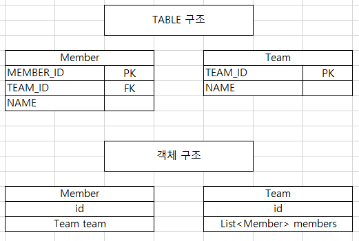

# :newspaper: JPA 연관관계 매핑에 대해 알아보자

:exclamation: 
객체 관계 매핑(ORM)에서 가장 어려운 부분이 객체 연관관계와 테이블 연관관계를 매핑하는 일이다.  
연관관계를 매핑할 때 다음 3가지를 고려해야 한다.

## 연관관계 매핑
- 연관관계 방향
    - 단방향
        - 회원과 팀 두개의 객체가 존재할때 회원 -> 팀, 팀 -> 회원 한쪽으로만 참조할 경우 단방향 관계이다.  
    - 양방향
        - 실제 업무를 하다보면 보통 회원이 팀에 속해있고 팀안에 회원이 있기때문에 이처럼 서로 참조 할 경우 양방향 관계이다.

- 다중성
    - 일대다(1:N), 다대일(N:1), 일대일(1:1), 다대다(N:M)
        - 회원과 팀 관계가 있을경우
            - 한 회원이 여러 팀에 속할 경우 회원 입장에서 보면 일대다(1:N)의 다중성을 가지게 된다.
            - 여러 회원이 한 팀에 속할 경우 팀 입장에서 보면  다대일(N:1)의 다중성을 가지게 된다.
    - 테이블은 양방향 관계를 가지고 있지만 객체 입장에서는 사실 양방향 관계를 가지기 쉽지 않다.  
    객체의 양방향 관계는 사실 양방향 관계가 아닌 서로 다른 단방향 2개의 관계를 만들어주는것이다.
    
- 연관관계의 주인
    - Entity를 생성할때 서로 양방향 관계를 가지게 될 경우 연관관계의 주인을 필수로 정해줘야 나중에 데이터 오류를 방지할 수 있다.

### :star: 연관관계 매핑 예제(중요)
- 회원 Entity   
``` java
public class Member {
    @Id
    @Column(name = "MEMBER_ID")
    private String id;

    private String username;

    // 연관 관계 맵핑
    @ManyToOne
    @JoinColumn(name="TEAM_ID")
    private Team team;
}
```
- 팀 Entity
``` java
public class Team {

    @Id
    @Column(name = "TEAM_ID")
    private String id;

    private String name;
    
    @OneToMany(mappedBy = "team")
    private List<Member> members = new ArrayList<>();
}
```
Entity 의 구성이 위와 같이 생성되었다고 가정하자.
다수의 회원은 한 팀에 속할수 있기에 @ManyToOne 관계로 설정하고, 하나의 팀은 다수의 회원을 가질 수 있기에 @OneToMany 관계로 지정했다.   
여기서 팀 객체쪽을 보면 멤버와 다르게 (mappedBy = "team")를 볼 수 있는데 이것이 서로 양방향 관계를 가질 때 연관관계의 주인이  
누구인지 설정해주는 속성이다. 
- :star: 연관관계의 주인(mappedBy) :star:
    - 두 객체의 관계중 하나의 연관관계의 주인으로 지정해주는것이다.
    - 연관관계의 주인만이 외래키를 관리하며 등록, 수정을 할 수 있다.
    - 주인이 아닌쪽은 읽기만 가능하다.
    - 주인은 mappedBy 속성을 설정하지 않는다.
    - 주인이 아니면 mappedBy 속성을 사용하여 주인을 지정해준다.

- 주인은 누구로 설정해야할까?  
  
    - 외래 키가 있는곳으로 설정을 해야한다.  
      실제 테이블 구조에서는 회원 테이블에 팀 테이블의 PK를 가지고 있다.  
      사실 데이터 베이스 관점에서 보면 회원 테이블이 팀 테이블의 PK를 가지고 있는 것만으로  
      회원이나 팀중 데이터를 조회할 기준 테이블을 JOIN 으로 SQL을 작성하면 데이터를 가져올 수 있다.   
      하지만 객체는 그렇지 않기때문에 외래키가 있는 곳을 주인으로 설정해야한다.

- :star: 연관관계의 주인(mappedBy)을 설정해야하는 이유 :star:
    - 연관관계의 주인을 설정해주지 않으면 예를 들어 회원속 팀을 수정했는데 팀에서 데이터 변경이 된다던가 이런 불상사가 발생할 수 있다.

- 데이터를 입력할땐 어떻게 해야할까?
``` java 
// 팀 생성
Team team = new Team();
team.setName("TeamA");
// 영속성 컨텍스트에 저장
em.persist(team);

// 회원 생성
Member member = new Member();
member.setName("member1");

// 여기서 팀의 객체 안에 있는 회원 리스트안에 회원을 추가해준다.
// 순수한 객체 관계를 고려해서 항상 양쪽다 데이터를 입력해주어야한다.
team.getMembers().add(member);

//연관관계의 주인에 값 설정
member.setTeam(team);
em.persist(member);
```